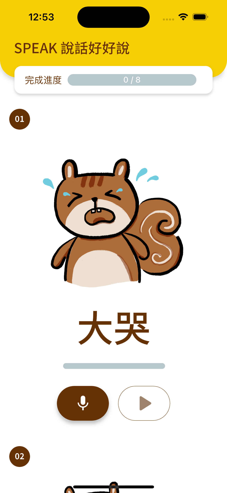

# Speak Slowly
## Introduction
This app is made for children with voice disorders. By recording their voice, the app will analyze the voice and give feedback to the user. The app will also provide treatment advice to the user.

## Architecture: Flutter + Firebase + Flask + Pytorch
- The app is made with Flutter and is currently available for Android and iOS.
- The voice is recorded, compressed to zip, and uploaded to Firebase Storage.
- After the records are uploaded, Flutter will send a request to fetch the server URL from the Realtime database on Firebase, then send a POST request to the Flask server; the server will download those records and run the analysis. The voice analysis is done with the help of the AI model we developed using Pytorch.

    > We save the server URL on the Realtime database on Firebase because the server is forward with Ngrok free plan, and Ngrok will change the URL every time we restart the server. So, we need to fetch the URL from Firebase every time we want to send a request to the server.

## User Interface
The user interface is intuitive, user-friendly, and aesthetically pleasing.

<table border="0">
    <tr>
        <td colspan="4" style="text-align:center; font-size:14px;"><b>All Pages<b></td>
    </tr>
    <tr>
        <td width="25%" style="text-align:center;font-size:14px;"><b>Homepage<b></td>
        <td width="25%" style="text-align:center;font-size:14px;"><b>ConsentPage<b></td>
        <td width="25%" style="text-align:center;font-size:14px;"><b>BasicInfoPage<b></td>
        <td width="25%" style="text-align:center;font-size:14px;"><b>RecordPage (Recording)<b></td>
    </tr>
    <tr>
        <td></img></td>
        <td></img></td>
        <td></img></td>
        <td></img></td>
    </tr><tr>
        <td width="25%" style="text-align:center;font-size:14px;"><b>RecordPage (Uploading)<b></td>
        <td width="25%" style="text-align:center;font-size:14px;"><b>ResultPage<b></td>
        <td width="25%" style="text-align:center;font-size:14px;"><b>ResourcePage<b></td>
        <td width="25%" style="text-align:center;font-size:14px;"><b>TreatmentMapPage<b></td>
    </tr>
    <tr>
        <td></img></td>
        <td></img></td>
        <td></img></td>
        <td></img></td>
    </tr>
</table>

## Project Structure
```
.
├── LICENSE
├── README.md
├── analysis_options.yaml
├── android
├── assets
├── build
├── ios
├── lib
├── linux
├── macos
├── pubspec.lock
├── pubspec.yaml
├── speak_slowly.iml
├── test
├── web
└── windows
```

- `lib`

    All the source code is in the directory.

- `android`
    
    It contains the Android project. We only need to set up the Firebase authentication (we will talk about it later), microphone, and storage permission in `android/app/src/main/AndroidManifest.xml`, and Flutter generates the rest of the code.

- `ios`
    
    Similar to the Android project, we only need to setup the Firebase authentication, microphone and storage permission in `ios/Runner/Info.plist`, and the rest of the code is generated by Flutter.

- `assets`
    
    It contains fonts and all the images. If you want to add more images or fonts, you will have to add the path to `pubspec.yaml`.


## Logic Flow
1. `Homepage`: Users can click the `開始測驗` button to start the app.

2. `ConsentPage`: This page is for parents to read the consent form and agree to the terms and conditions.

3. `BasicInfoPage`: Parents need to fill in the basic information of the user.


    - The style of date picker is different depending on the platform.

        <table width="500" border="0">
            <tr>
                <td colspan="4" style="text-align:center; font-size:14px;"><b>Style of date picker<b></td>
            </tr>
            <tr>
                <td width="50%" style="text-align:center;font-size:14px;"><b>iOS<b></td>
                <td width="50%" style="text-align:center;font-size:14px;"><b>Android<b></td>
            </tr>
            <tr>
                <td></img></td>
                <td></img></td>
            </tr>
        </table>
    
    - The number of questions is different depending on the user's age.
        1. For children 3 years old, there are 8 questions.
        
        2. For children 4 years old, there are 19 questions.
        
        3. For children over 5 years old, there are 27 questions.

        4. Children under 3 years old cannot use the app because the analysis is not accurate enough.

            <table width="250" border="0">
                <tr>
                    <td style="text-align:center;font-size:14px;"><b>Warning<b></td>
                </tr>
                <tr>
                    <td></img></td>
                </tr>
            </table>

    - Some of questions are multiple-choice questions, it can be determined in `jsonQuestionInfoString` in `text_constants.dart`. You can also update the question if needed.
    
        ```json
        {
            "# of question": {
                "question": "Content",
                "options": ["option_01", "option_02"],
                "multiselect": false
            },
        }
        ```

4. `RecordPage`: Users can record their voice and submit them to the server for analysis.

    - **The app will ask for permission to access the microphone and storage.**

    - Each question has a 3-second time limit to record, and if the volume is too low (< 55dB), the app will ask the user to re-record. Only if the record is done will the app enable the play button.

        <table width="500" border="0">
            <tr>
                <td colspan="4" style="text-align:center; font-size:14px;"><b>Toast<b></td>
            </tr>
            <tr>
                <td width="50%" style="text-align:center;font-size:14px;"><b>Volume too low<b></td>
                <td width="50%" style="text-align:center;font-size:14px;"><b>Volume is good<b></td>
            </tr>
            <tr>
                <td></img></td>
                <td></img></td>
            </tr>
        </table>
    
    - Users can re-record the voice if they are not satisfied with the recording.

    - Users can play the recording before uploading.

    - After all the records are done, users can click "完成", and the app will compress the records to zip and upload them to Firebase Storage.

    - If the uploading is timeout or failed due to network issues, the app will ask the user to re-upload.

        <table width="250" border="0">
            <tr>
                <td style="text-align:center;font-size:14px;"><b>Try again<b></td>
            </tr>
            <tr>
                <td></img></td>
            </tr>
        </table>

    - If you want to add more questions, you will have to update `jsonQuestionRecordString` in `text_constants.dart` and add picture path to `pubspec.yaml`.

5. `ResultPage`: This page shows the result of the analysis, treatment advice and treatment map.

6. `ResourcePage`: This page shows the resources for parents.

    - Resource links are saved in `text_constants.dart`.
    

7. `TreatmentMapPage`: This page shows the treatment map for parents.

    - Resource links are saved in `text_constants.dart`.

## Dev Environment
- macOS Ventura 13.0.5
- Flutter 3.13.0
- Xcode 14.3.1
- Android Studio 2021.2 (SDK version 33.0.0)
- VS Code 1.81.1 (with the flutter extension)
- Dart 3.1.0

## How to build the app?
1. Install the [Flutter, Xcode and Android Studio](https://docs.flutter.dev/get-started/install/macos).

2. Clone the project.

3. Edit the bundle identifier (bundle id) to yours in **Signing & Capabilities** tab in Xcode.

    

4. Add Firebase authentication to the app (Of course, you need to have the permissions to access the Firebase project first).

    

    - For iOS, add the `GoogleService-Info.plist` file to `ios/Runner/` directory.
    - For Android, add the `google-services.json` file to `android/app/` directory.

5. Run the following command before building the project:

    ```bash
    $ flutter clean && cd ios && rm -rf Pods && rm Podfile.lock && cd ..
    ```

6. Gets all the Flutter dependencies listed in the `pubspec.yaml` file
    
    ```bash
    $ flutter pub get
    ```

7. Select a device (either a simulator or a physical device) to run the app on.

    This can be done by clicking the device name in the bottom right corner of VS Code, or build the app with Xcode or Android Studio.

    

8. Have fun!

    


## How to publish the app?
- **iOS**
    
    This [article](https://designcode.io/swiftui-advanced-handbook-archive-a-build-in-xcode) tells how to archive a build step by step in Xcode. I won't repeat it here.
    
- **Android**
    
    Please refer to this [article](https://appinventiv.com/blog/how-to-submit-app-to-google-play-store/).